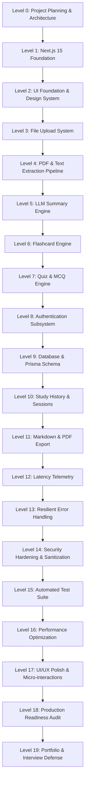

# Development Roadmap & Level Execution Matrix

## AI Study Summarizer — PDF/Notes to Flashcards & Quiz
**Target Year:** 2026  
**Engineering Progression:** 19 Discrete Verification Levels (Level 00 → Level 18 + Interview Audit Level 19)

---

## 🎯 Development & Git Workflow Standard

Each level follows the strict Level Execution Protocol:
1. **Inspect**: Check Git status, branch, code integrity, and environment.
2. **Explain**: Define deliverables, architecture impact, and file touchpoints.
3. **Branch**: Cut `level-XX-<name>` from latest `main`.
4. **Implement**: Build strictly within scope of current level.
5. **Validate**: Run linting, TypeScript checks, unit/integration tests, and production build.
6. **Review**: Mini security and code quality review.
7. **Document**: Update architecture and progress tracking.
8. **Commit**: Standard conventional commit (e.g. `feat: implement level XX - ...`).
9. **Push**: Push branch to GitHub remote.
10. **Merge**: Merge via `--no-ff` into `main`.
11. **Verify Main**: Validate `npm run build` and tests on `main`.
12. **Report**: Emit structured Level Completion Report.

---

## 🗺️ Master Level Matrix

---

## 📋 Level-by-Level Breakdown

### Level 00: Project Planning & Architecture
- **Branch**: `level-00-planning`
- **Scope**: Repository initialization, comprehensive architectural blueprints (`README.md`, `PROJECT_ARCHITECTURE.md`, `DEVELOPMENT_ROADMAP.md`), GitHub connection, Git branching strategy.
- **Verification**: Document completeness, valid Git state.
- **Status**: 🟢 Completed

---

### Level 01: Next.js 15 Foundation
- **Branch**: `level-01-foundation`
- **Scope**: Next.js 15 App Router scaffold, React 19, TypeScript strict mode, TailwindCSS v4 configuration, ESLint, `.env.example`, clean folder architecture (`src/app`, `src/components`, `src/lib`, `src/services`, `src/hooks`, `src/types`, `src/utils`, `src/config`).
- **Verification**: `npm run build` succeeds, clean dev server startup.
- **Status**: 🟢 Completed

---

### Level 02: UI Foundation & Design System
- **Branch**: `level-02-ui`
- **Scope**: Modern EdTech design system with rich dark/light styling, glassmorphism accents, ShadCN UI primitives, responsive Navbar, Hero section, Study Dashboard skeleton, Flashcard card frame, Quiz interface layout, empty & loading states.
- **Verification**: Responsive on mobile/desktop, zero console warnings.
- **Status**: 🟢 Completed

---

### Level 03: File Upload System
- **Branch**: `level-03-upload`
- **Scope**: Drag-and-drop zone, file picker, client-side & server-side validation (MIME types, 25MB size cap, supported extensions `.pdf`, `.txt`, `.md`), upload progress bar, realistic processing state indicators.
- **Verification**: Rejection of invalid file types and oversized files; smooth progress animations.
- **Status**: 🟢 Completed

---

### Level 04: PDF & Text Extraction Pipeline
- **Branch**: `level-04-pdf-extraction`
- **Scope**: PDF text extraction engine (`pdfjs-dist` / `pdf-parse`), multi-page parsing, text normalization, Unicode cleaning, noise reduction, scanned/image-only PDF detection, token-aware semantic chunking with overlap.
- **Verification**: Unit tests on text extraction, handling of corrupted and empty documents.
- **Status**: 🟢 Completed

---

### Level 05: LLM Summary Engine
- **Branch**: `level-05-ai-summary`
- **Scope**: Provider-independent AI abstraction (`LLMProvider`), Google Gemini / OpenAI adapters, structured summary schema validation via Zod, anti-prompt injection XML envelope, rate limit & timeout error handling.
- **Verification**: Deterministic JSON summary parsing, fallback on schema mismatch.
- **Status**: 🟢 Completed

---

### Level 06: Flashcard Generation Engine
- **Branch**: `level-06-flashcards`
- **Scope**: Structured flashcard generation endpoint, 3D CSS flip card component, keyboard navigation (Space to flip, Arrows to advance), shuffle algorithm, difficulty rating (Easy/Medium/Hard), study progress indicator.
- **Verification**: Smooth 60fps flip animation, accurate card progression.
- **Status**: 🟢 Completed

---

### Level 07: Quiz & MCQ Engine
- **Branch**: `level-07-quiz`
- **Scope**: AI-generated 4-option MCQs with explanations, step-by-step interactive quiz viewer, hidden correct answer validation on client, instant feedback, score & percentage calculation, final assessment summary screen.
- **Verification**: Reliable score computation, clear rationales displayed post-answer.
- **Status**: 🟢 Completed

---

### Level 08: Authentication Subsystem
- **Branch**: `level-08-auth`
- **Scope**: Auth.js (NextAuth v5) integration, JWT session handling, credentials provider, password hashing with bcrypt, protected route middleware (`/dashboard`, `/study/*`), user profile dropdown.
- **Verification**: Unauthenticated redirect to login, valid session preservation across page reloads.
- **Status**: 🟢 Completed

---

### Level 09: Database & Data Model
- **Branch**: `level-09-database`
- **Scope**: Prisma ORM setup, relational schema for `User`, `StudySession`, `Document`, `Summary`, `FlashcardSet`, `Flashcard`, `Quiz`, `QuizQuestion`, `QuizAttempt`. Database singleton client with global pooling.
- **Verification**: Schema migration applies cleanly, relations cascade on delete.
- **Status**: 🟢 Completed

---

### Level 10: Study History & Dashboard
- **Branch**: `level-10-history`
- **Scope**: User study session history listing, session search & format filtering, single session hydration into workspace (`/dashboard?sessionId=...`), session deletion with cascade, quiz attempt history tracking.
- **Verification**: Smooth resume-study transition, accurate filtering across PDF, text notes, and markdown.
- **Status**: 🟢 Completed

---

### Level 11: Markdown & PDF Export
- **Branch**: `level-11-export`
- **Scope**: Clean Markdown export generator (formatted summary, flashcard Q&A list, quiz with answer key), PDF document export generator with clean typography, page-break rules, and Anki/Quizlet CSV copy.
- **Verification**: Downloaded `.md` and `.pdf` files are well-formatted and render without truncation.
- **Status**: 🟢 Completed

---

### Level 12: Latency Telemetry & Observability
- **Branch**: `level-12-telemetry`
- **Scope**: Non-PII latency logging interceptor, timings for extraction, chunking, AI generation roundtrips, token estimation, throughput calculations (tok/s), dev telemetry dashboard widget with stage-by-stage breakdown.
- **Verification**: Accurate elapsed time measurement; zero leakage of user PII or raw documents.
- **Status**: 🟢 Completed

---

### Level 13: Resilient Error Handling Pass
- **Branch**: `level-13-error-handling`
- **Scope**: Standardized API error response envelopes, custom error classes (`ValidationError`, `ExtractionError`, `AIServiceError`, `AuthError`, `RateLimitError`), React error boundaries (`error.tsx`, `not-found.tsx`, `global-error.tsx`), accessible toast notification system.
- **Verification**: Controlled UI recovery on network timeout or AI rate-limit failure.
- **Status**: 🟢 Completed

---

### Level 14: Security Hardening & Sanitization
- **Branch**: `level-14-security`
- **Scope**: Prompt injection defense audit, XML sandboxing, server-only environment variable isolation, MIME magic byte validation, CSRF/XSS review, in-memory rate limiting.
- **Verification**: Penetration testing against prompt injection payloads and malicious files.
- **Status**: ⏳ Pending

---

### Level 15: Comprehensive Testing Layer
- **Branch**: `level-15-testing`
- **Scope**: Vitest unit test suite (chunking, cleaning, score math, Zod schemas), API integration tests with mock AI providers, React component rendering tests.
- **Verification**: `npm run test` executes and passes all test suites.
- **Status**: ⏳ Pending

---

### Level 16: Performance Optimization
- **Branch**: `level-16-performance`
- **Scope**: Dynamic code-splitting for heavy libraries (`pdfjs-dist`, export utilities), React Server Components bundle reduction, streaming UI responses, caching optimizations.
- **Verification**: Lighthouse performance score > 90, bundle size analysis.
- **Status**: ⏳ Pending

---

### Level 17: UI/UX Polish & Micro-Interactions
- **Branch**: `level-17-polish`
- **Scope**: Polish transitions, subtle hover micro-animations, skeleton loaders, accessible ARIA labels, full keyboard navigation, mobile touch gestures on flashcards.
- **Verification**: Premium SaaS aesthetic audit, zero accessibility violations.
- **Status**: ⏳ Pending

---

### Level 18: Production Readiness & Final Audit
- **Branch**: `level-18-production`
- **Scope**: Full clean installation build verification (`npm install`, `npm run lint`, `npm run test`, `npm run build`), production deployment configurations, finalized documentation.
- **Verification**: Zero build or lint errors on `main`.
- **Status**: ⏳ Pending

---

### Level 19: Portfolio & Interview Defense Guide
- **Branch**: `main`
- **Scope**: Technical interview defense manual, architectural trade-offs, security and AI hallucination defenses, sample senior engineering interview Q&A based on the implemented codebase.
- **Status**: ⏳ Pending
